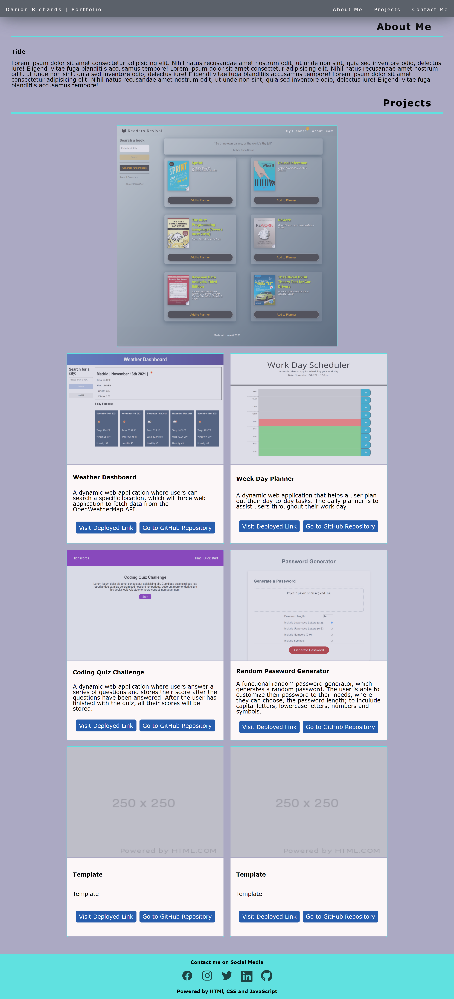

## **Table of Contents**

1.  [Deployed Page URL](#deployed-page-url)
2.  [Introduction](#introduction)
3.  [Descripton](#description)
4.  [Demo](#demo)

## **Deployed Link to Portfolio**

https://darionrichards.github.io/my-project-portfolio/

## **Introduction**

In this project, I am creating a functional portfolio webpage, that will show my completed projects to prove my skills to employers

## **Description**

Within this project, I have created a functional portfolio webpage, that contains the use of:

- Flex boxes
  - For navigation bar
  - For Main project
  - For other 6 projects
- Media queries for resizing of page
- Functional navigation bar
  - With **JavaScript** to produce a dropdown list **within a mobile view**
- CSS Variables
- Colour Schemes (with use of variables)
- Typography troughout the webpage

## **Demo**

